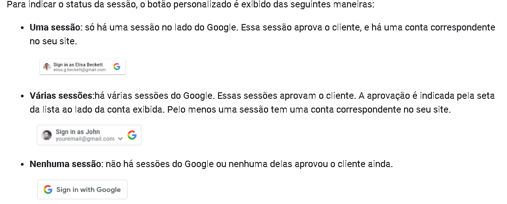

# Sticket Backup

Este projeto visa a implementação de uma aplicação Mobile para realizar o backup dos Stickets do Whatsapp, possibilitando a Importação / Exportação das Figurinhas.
Projeto criando usando React Native com Expo
Para criar um clone e rodar esse projeto é necessário instalar o expo.

## REQUISIÇÕES DE PROJETO // caso de uso

- Exportar stickets do usuario // acesso ao armazenamento do usuario de forma automatica (v2)
- Armazenamento dos stickets em nuvem
- Importar stickets do usuario // pegar os Stickets da nuvem e adicionar no armazenamento interno

### Funcionalidades extras

-- Integrar aplicação para criar pacotes de stickets no whatsapp
-- tela de copyright > adicionar perfis dos devs.

## TELA > Front END

> Tela Home c

    - Botão de Login no app através do google drive
     Adicione um botão "Fazer login com o Google" claramente visível e seguro a uma página de criação ou configuração de conta.
        - UX do botão "Fazer login com o Google" Um botão personalizado dá aos usuários uma indicação rápida do status da sessão,
         do Google e do app, antes de clicar no botão.
            Veja exeplo em 

> Tela de Interação

    - Botão de Upload de arquivos / Exportar
    - Botão de Dowload de arquivos / Importar

## BackEnd

-> Faça login com um toque, se você já estiver conectado à sua Conta do Google.

## LINKS uteis para implementação do projeto.

> Implementar a autenticação com o google drive

    "https://developers.google.com/workspace/guides/get-started"

> Gerenciamentos das pastas do Drive

    "https://developers.google.com/drive/api/guides/manage-sharing"

## Frontend

-> Adicionei a pasta Style e criei dois arquivos
como mesmo nome dos components